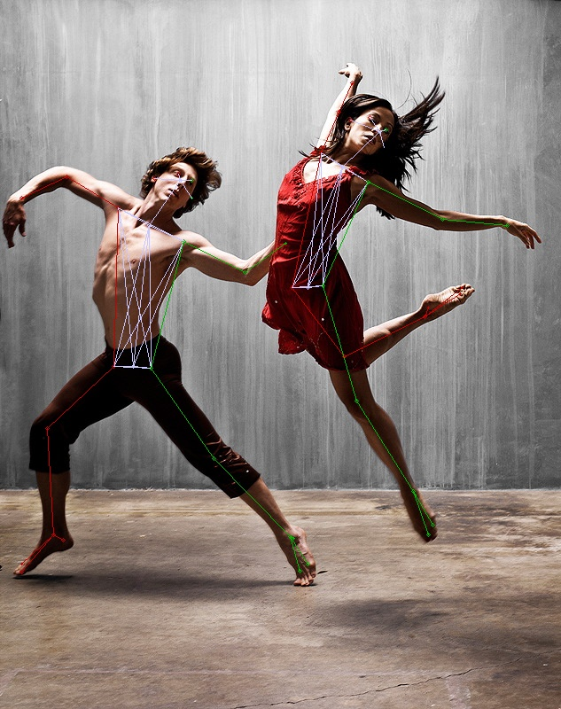

# OpenPose API
Simple containerized REST API extracting (and draw) [CMU OpenPose](https://github.com/CMU-Perceptual-Computing-Lab/openpose/) (human pose) key-points from images (provided as file or url). 
This version is GPU accelerated, using CUDA (10.0) and CuDNN (7.5) compatible hardware.

Example output image:



Example output JSON:
```
{
  "people": [
    {
      "gender": null,
      "age": null,
      "pose": {
        "nose": {
          "x": 0.677286639221095,
          "y": 0.18542898178100586,
          "confidence": 0.9316593408584595
        },
        "neck": {
          "x": 0.6110341823873173,
          "y": 0.2352118682861328,
          "confidence": 0.8109888434410095
        },
        "right_shoulder": {
          "x": 0.5725101031021672,
          "y": 0.21583173751831056,
          "confidence": 0.8107086420059204
        },
        "right_elbow": {
          "x": 0.6039714120198953,
          "y": 0.1578795051574707,
          "confidence": 0.6835763454437256
        },
        "right_wrist": {
          "x": 0.6284193668696929,
          "y": 0.11647865295410156,
          "confidence": 0.8801245093345642
        },
        "left_shoulder": {
          "x": 0.6563097334586049,
          "y": 0.2572347831726074,
          "confidence": 0.8132572770118713
        },
        "left_elbow": {
          "x": 0.7887055937901116,
          "y": 0.30966285705566404,
          "confidence": 0.790416419506073
        },
        "left_wrist": {
          "x": 0.9037675179576422,
          "y": 0.317821159362793,
          "confidence": 0.8730279207229614
        },
        "mid_hip": {
          "x": 0.548264248864534,
          "y": 0.4061676788330078,
          "confidence": 0.7308455109596252
        },
        "right_hip": {
          "x": 0.5203646257590343,
          "y": 0.4062485122680664,
          "confidence": 0.6943361759185791
        },
        "right_knee": {
          "x": 0.6144056757102834,
          "y": 0.5027524185180664,
          "confidence": 0.7306333780288696
        },
        "right_ankle": {
          "x": 0.7574588721397364,
          "y": 0.4474960708618164,
          "confidence": 0.7879128456115723
        },
        "left_hip": {
          "x": 0.5761545190313981,
          "y": 0.40345027923583987,
          "confidence": 0.6901074647903442
        },
        "left_knee": {
          "x": 0.6354786660433945,
          "y": 0.5662445831298828,
          "confidence": 0.819564163684845
        },
        "left_ankle": {
          "x": 0.7363890637342022,
          "y": 0.693160400390625,
          "confidence": 0.7974473237991333
        },
        "right_eye": {
          "x": 0.6599168340553416,
          "y": 0.16619421005249024,
          "confidence": 0.9014793038368225
        },
        "left_eye": {
          "x": 0.6877881572898153,
          "y": 0.18274955749511718,
          "confidence": 0.8851550817489624
        },
        "right_ear": {
          "x": 0.6248565722039149,
          "y": 0.1688811492919922,
          "confidence": 0.889176070690155
        },
        "left_ear": {
          "x": 0.6843981027226501,
          "y": 0.2075032615661621,
          "confidence": 0.16915567219257355
        },
        "left_bigtoe": {
          "x": 0.7645028884188636,
          "y": 0.7538619995117187,
          "confidence": 0.7830573320388794
        },
        "left_smalltoe": {
          "x": 0.7714290287445695,
          "y": 0.7400554656982422,
          "confidence": 0.7159634232521057
        },
        "left_heel": {
          "x": 0.7401083513835407,
          "y": 0.6986153411865235,
          "confidence": 0.5403489470481873
        },
        "right_bigtoe": {
          "x": 0.8237912146401066,
          "y": 0.40610370635986326,
          "confidence": 0.6505764722824097
        },
        "right_smalltoe": {
          "x": 0.820223213183748,
          "y": 0.4144353103637695,
          "confidence": 0.6157740354537964
        },
        "right_heel": {
          "x": 0.7644432031712826,
          "y": 0.4338855361938477,
          "confidence": 0.5651904344558716
        }
      }
    },
    {
      "gender": null,
      "age": null,
      "pose": {
        "nose": {
          "x": 0.3215829327961468,
          "y": 0.25453336715698244,
          "confidence": 0.9654165506362915
        },
        "neck": {
          "x": 0.26596107904756616,
          "y": 0.3178150177001953,
          "confidence": 0.928391695022583
        },
        "right_shoulder": {
          "x": 0.21012789227574546,
          "y": 0.2929931831359863,
          "confidence": 0.8403418064117432
        },
        "right_elbow": {
          "x": 0.11937395430289173,
          "y": 0.2488512420654297,
          "confidence": 0.8523696064949036
        },
        "right_wrist": {
          "x": 0.039153621848348946,
          "y": 0.2793436050415039,
          "confidence": 0.8333181738853455
        },
        "left_shoulder": {
          "x": 0.32853139482591576,
          "y": 0.3400200653076172,
          "confidence": 0.8353562355041504
        },
        "left_elbow": {
          "x": 0.436659633642501,
          "y": 0.38402713775634767,
          "confidence": 0.8656612634658813
        },
        "left_wrist": {
          "x": 0.5097585379794876,
          "y": 0.3427619552612305,
          "confidence": 0.5537052154541016
        },
        "mid_hip": {
          "x": 0.23780097177996642,
          "y": 0.5165453720092773,
          "confidence": 0.7827401161193848
        },
        "right_hip": {
          "x": 0.20298176504801047,
          "y": 0.5164376831054688,
          "confidence": 0.7337585687637329
        },
        "right_knee": {
          "x": 0.08450797082500247,
          "y": 0.6049499893188477,
          "confidence": 0.8458415269851685
        },
        "right_ankle": {
          "x": 0.09507068676217849,
          "y": 0.7538065338134765,
          "confidence": 0.8094685673713684
        },
        "left_hip": {
          "x": 0.26935891969509035,
          "y": 0.5192223739624023,
          "confidence": 0.729832112789154
        },
        "left_knee": {
          "x": 0.3808291707935303,
          "y": 0.6462666320800782,
          "confidence": 0.8145111799240112
        },
        "left_ankle": {
          "x": 0.5167471597921603,
          "y": 0.7565208435058594,
          "confidence": 0.7894134521484375
        },
        "right_eye": {
          "x": 0.3180591167431872,
          "y": 0.24611305236816405,
          "confidence": 0.9129397869110107
        },
        "left_eye": {
          "x": 0.3425561263097971,
          "y": 0.25456857681274414,
          "confidence": 0.900324285030365
        },
        "right_ear": {
          "x": 0.2763218209265156,
          "y": 0.2516548347473144,
          "confidence": 0.8345515131950378
        },
        "left_ear": {
          "x": 0.342515171044999,
          "y": 0.2793706512451172,
          "confidence": 0.37775322794914246
        },
        "left_bigtoe": {
          "x": 0.5343347823638674,
          "y": 0.8062393951416016,
          "confidence": 0.7804844975471497
        },
        "left_smalltoe": {
          "x": 0.5483272606727636,
          "y": 0.795229721069336,
          "confidence": 0.7149602770805359
        },
        "left_heel": {
          "x": 0.5238838858702359,
          "y": 0.7592790985107422,
          "confidence": 0.6040292978286743
        },
        "right_bigtoe": {
          "x": 0.03924421036224606,
          "y": 0.80625732421875,
          "confidence": 0.7193943858146667
        },
        "right_smalltoe": {
          "x": 0.03901440950366558,
          "y": 0.7952497100830078,
          "confidence": 0.6273979544639587
        },
        "right_heel": {
          "x": 0.11242936120779029,
          "y": 0.7620455932617187,
          "confidence": 0.8011491894721985
        }
      }
    }
  ],
  "vehicles": [],
  "things": []
}
```

## Prerequisites
Other container orchestration software, like Kubernetes may also be used, but Docker is the easiest. 
- Nvidia GPU and drivers on the Host. 
- [Docker](https://docs.docker.com/get-docker/)
- [Nvidia Docker Runtime](https://github.com/NVIDIA/nvidia-docker)
- [docker-compose](https://docs.docker.com/compose/install/)
 
## Getting Started

Build or download openpose container [haleyai/openpose](https://github.com/haleyai/openpose-docker/).

```
git clone https://github.com/lyngon/openpose-api.git
cd openpose-api
docker-compose up -d
```

In a browser visit `http://localhost:8080/docs`. Assuming the browser is running on the same machine.
If everything worked, you should see an interactive Swagger documentation wehere you can try out the API.  

## To Do
- Generalize to also run on CPU 
- Kubernetes example


